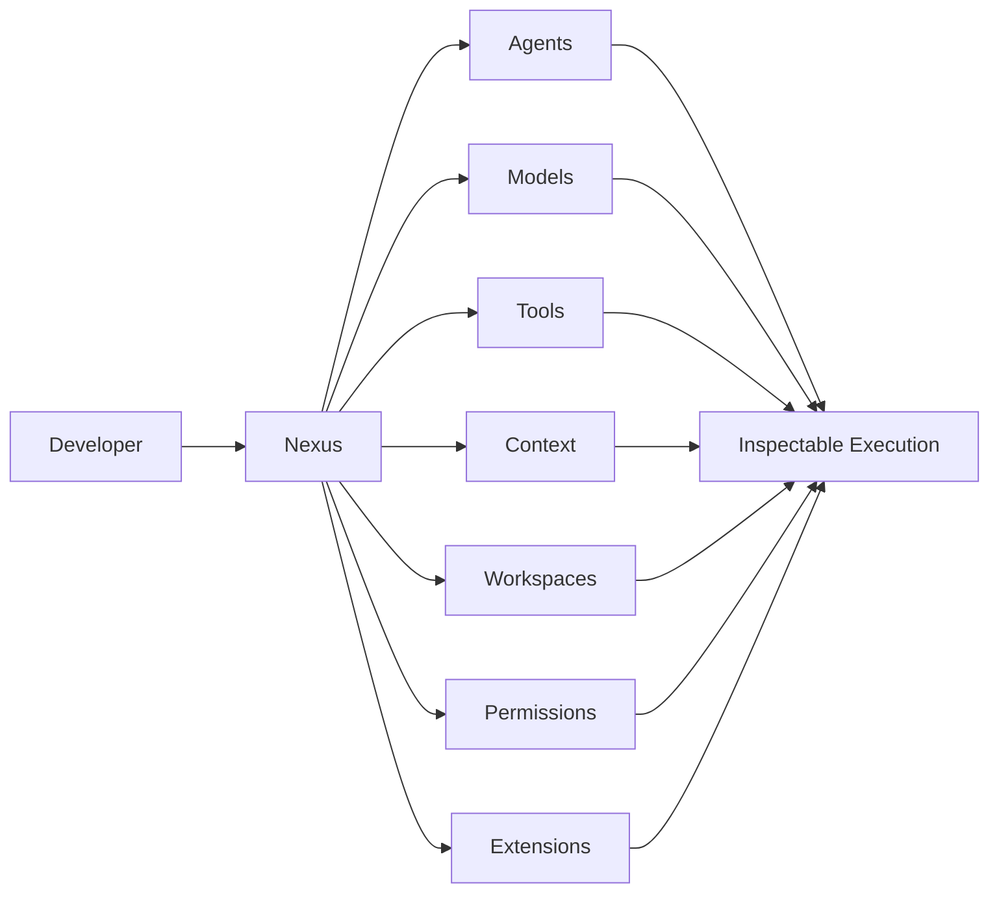
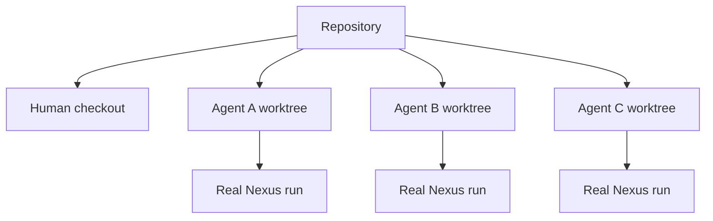
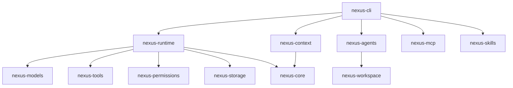

<div align="center">

# ◈ Nexus

### The programmable AI harness for developers, agents, and autonomous workflows.

**Local-first · Model-agnostic · Tool-native · Workspace-isolated · Observable by design**

[](https://www.rust-lang.org/)
[](https://github.com/timothynn/Nexus/actions/workflows/ci.yml)
[](LICENSE)
[](https://github.com/timothynn/Nexus/issues)

[**Quick Start**](#-quick-start) · [**Working Now**](#-whats-working-now) · [**Architecture**](#-architecture) · [**CLI**](#-cli-surfaces) · [**Roadmap**](#-roadmap)

</div>

---

> **Nexus is not another AI chat wrapper.** It is a configurable runtime where models, agents, tools, permissions, context, sessions, workspaces, skills, hooks, and integrations are composable primitives.

## ⚡ Why Nexus?



Nexus is built around a simple rule:

> **AI should be powerful without becoming a black box.**

A run can expose its model requests, tool calls, permission decisions, workspace boundaries, instructions, Git priorities, token estimates, audit events, and durable replay history.

# 🚀 Quick Start

## Build

```bash
git clone https://github.com/timothynn/Nexus.git
cd Nexus
cargo build --workspace
```

## Deterministic local run

```bash
cargo run -p nexus-cli -- run "inspect this repository"
```

## Real OpenAI-compatible provider

```bash
export OPENAI_API_KEY="..."

cargo run -p nexus-cli -- run \
  --provider openai-compatible \
  --model "your-model-id" \
  "inspect this repository"
```

## Tool-enabled agent with audit persistence

```bash
cargo run -p nexus-cli -- run \
  --provider openai-compatible \
  --model "your-model-id" \
  --tools \
  --session \
  --git-context \
  "inspect the changed files, run relevant tests, and explain the result"
```

Press **Ctrl+C** to cooperatively cancel a controlled run. The runtime checks cancellation before and during model/tool execution boundaries and records cancellation in the audit trace.

## Replay a run

```bash
nexus replay <session-id>
```

# 🟢 What's Working Now

## 🧠 Model gateway

- Provider-neutral `ModelProvider` contract
- Structured chat requests and responses
- Streaming contracts
- Model capabilities
- Tool definitions and structured tool calls
- Deterministic mock provider
- OpenAI-compatible Chat Completions provider
- Environment-based API key loading

## 🔄 Agent runtime — Phase 1 complete

```text
Task
 ↓
Instructions + Git priorities
 ↓
Model
 ↓
Tool call?
 ├── No  → Final result
 └── Yes
      ↓
Permission policy
      ↓
Allow / Ask / Deny / Sandbox
      ↓
Tool execution
      ↓
Audit event + tool result
      ↓
Model continues
```

Implemented:

- Bounded model-driven tool loop
- Maximum-step protection
- Permission enforcement before every tool
- CLI approvals for `ask`
- Cooperative cancellation
- OS Ctrl+C wired to controlled runs
- Structured audit events
- Tool failure events
- Durable SQLite audit persistence
- Ordered run replay
- Aggregated token usage

## 🛠️ Built-in tools

| Tool | Status | Boundary |
|---|---|---|
| `filesystem.read` | 🟢 | Existing paths remain inside the workspace root |
| `shell.execute` | 🟢 | Direct program + args, workspace cwd, timeout, no command shell |

## 🌳 Isolated workspaces and real parallel agents



Nexus supports:

- Git worktree lifecycle
- Isolated `nexus/<workspace>` branches
- One worktree per parallel agent
- Bounded concurrent scheduling
- Deterministic outcome ordering
- Partial-allocation rollback
- Safe removal with **no automatic merge** into the human checkout

Run parallel agents:

```bash
nexus agents run \
  "inspect different parts of this repository" \
  3 \
  --concurrency 2
```

Each invocation generates a unique workspace run name so repeated runs do not collide with previous agent worktrees.

# 🧭 Context + Sessions — Phase 2 complete

## Hierarchical instructions

Nexus resolves instructions from explicit layers:

```text
.nexus/instructions.md
        ↓
AGENTS.md at repository root
        ↓
Nested AGENTS.md files from root to target
        ↓
Agent template instructions
        ↓
Selected skill instructions
```

Inspect the chain:

```bash
nexus instructions src/main.rs
```

## Git-aware context

Nexus detects modified, staged, and untracked files and can prioritize them in agent guidance:

```bash
nexus context --git-aware
```

For agent runs:

```bash
nexus run --tools --git-context "review my current changes"
```

## Token budgets and inspection

```bash
nexus context --max-files 100 --token-budget 40000
nexus context --model gpt-5
```

The current model-aware accounting is an explicit **estimate** using model-family profiles. Provider-reported usage remains the source of truth for exact billing.

## Lightweight code search

```bash
nexus search "permission tool execution"
nexus search "ModelProvider" --limit 10
```

The first implementation is deterministic and local: it indexes discovered context lines in memory and ranks matches by query-term coverage.

# 🧩 Skills, Hooks, and Agent Templates

Project-local skills live at:

```text
.nexus/skills/<name>/SKILL.md
```

Inspect them:

```bash
nexus skills list
nexus skills show code-review
```

Agent templates live at:

```text
.nexus/agents/<name>.toml
```

Example:

```toml
name = "reviewer"
description = "Reviews changes before merge"
instructions = "Focus on correctness, tests, and regressions."
skills = ["code-review"]
```

Use a template and additional skills:

```bash
nexus run --tools \
  --agent-template reviewer \
  --skill rust-testing \
  "review the current changes"
```

Hook configuration lives at:

```text
.nexus/hooks.toml
```

Supported lifecycle keys:

```text
run_started
before_model
before_tool
after_tool
run_completed
run_failed
```

Hooks are currently **discovered and inspectable configuration**. Nexus intentionally does not execute hook commands implicitly; wiring execution through the permission boundary is the next safety-focused step.

# 🔌 MCP Foundation

Nexus now includes a dedicated `nexus-mcp` crate with a stdio JSON-RPC client foundation.

Current capabilities:

- Launch a local MCP server process
- Initialize a client session
- Discover tools with `tools/list`
- Invoke tools with `tools/call`
- Keep MCP transport separate from the Nexus runtime

Examples:

```bash
nexus mcp list-tools <program> -- <server-args>
```

```bash
nexus mcp call <program> <tool-name> '{"example":"value"}' -- <server-args>
```

The next step is adapting discovered MCP tools directly into the Nexus `ToolRegistry` under the same permission and audit boundaries as built-in tools.

# 🧬 Architecture

```text
apps/
└── nexus-cli/                 CLI and operator surfaces

crates/
├── nexus-core/                Stable domain types and contracts
├── nexus-config/              Layered configuration
├── nexus-context/             Discovery, instructions, Git context, search
├── nexus-agents/              Parallel scheduling contracts
├── nexus-models/              Provider-neutral model contracts + adapters
├── nexus-tools/               Tool registry and local tool boundaries
├── nexus-permissions/         Policies and approval contracts
├── nexus-runtime/             Agent loop, cancellation, and audit events
├── nexus-storage/             SQLite sessions and replay
├── nexus-workspace/           Isolated Git workspaces
├── nexus-mcp/                 MCP transport/client foundation
└── nexus-skills/              Skills, hooks, and agent templates
```



**Architectural rule:** `nexus-core` stays dependency-light. Provider-specific HTTP, MCP transport, Git operations, storage, and UI concerns remain outside the core contracts.

# ⌨️ CLI Surfaces

```text
nexus run [--tools] [--session] [--git-context]
nexus replay <session-id>
nexus context [--git-aware] [--model <name>]
nexus search <query>
nexus instructions [path]
nexus skills list|show|hooks|template
nexus mcp list-tools|call
nexus agents run <task> <count>
nexus worktree create|list|status|diff|remove|allocate-agents
nexus config
nexus models
nexus doctor
```

# 🗺️ Roadmap

## Phase 1 — Execution Core

- [x] Rust workspace and crate boundaries
- [x] Provider-neutral model contracts and streaming
- [x] OpenAI-compatible provider
- [x] Tool registry and JSON schemas
- [x] Filesystem and structured shell tools
- [x] Permission enforcement and approvals
- [x] Bounded model-driven tool loop
- [x] Git worktree lifecycle
- [x] Cooperative cancellation
- [x] OS signal cancellation for controlled CLI runs
- [x] Structured execution audit events
- [x] Durable SQLite audit persistence

## Phase 2 — Context + Sessions

- [x] Project `.nexus/` configuration discovery
- [x] Global configuration discovery
- [x] Environment overrides
- [x] SQLite sessions
- [x] Run history and replay
- [x] Deterministic repository discovery
- [x] Hierarchical instructions
- [x] Git-aware context prioritization
- [x] Token budgets and context inspection
- [x] Lightweight code indexing and search
- [x] Model-aware token estimates

## Phase 3 — Parallel Agents

- [x] One isolated workspace per agent
- [x] Bounded concurrent scheduler
- [x] Real Nexus runs assigned to workspaces
- [x] Deterministic result ordering
- [ ] Supervisor/reviewer workflows
- [ ] Task graphs and dependencies
- [ ] Automatic workspace cleanup policies
- [ ] Sandboxed/container workspace backends

## Phase 4 — Extensibility + Interfaces

- [x] MCP stdio client foundation
- [x] Local skills discovery
- [x] Hook configuration model
- [x] Agent templates
- [ ] MCP tools bridged into `ToolRegistry`
- [ ] Permission-controlled hook execution
- [ ] Plugin system and SDKs
- [ ] TUI
- [ ] Tauri desktop application
- [ ] Remote workers
- [ ] Team collaboration

# 📊 Project Status

| Area | Status |
|---|---|
| Execution core | 🟢 Phase 1 complete |
| Context + sessions | 🟢 Phase 2 complete |
| Parallel agents | 🟡 Real runs + worktrees implemented |
| MCP | 🟡 Stdio foundation implemented |
| Skills/templates | 🟡 Discovery + composition implemented |
| Hook execution | ⚪ Planned |
| Plugin system | ⚪ Planned |
| TUI/Desktop | ⚪ Planned |

> 🟢 Implemented &nbsp; 🟡 Foundation / in progress &nbsp; ⚪ Planned

# 🛠️ Development Workflow

```bash
cargo fmt --all
cargo build --workspace --all-targets
cargo test --workspace
cargo clippy --workspace --all-targets -- -D warnings
```

The repository's `AGENTS.md` defines the implementation loop and architectural constraints for future agents and contributors.

# 🤝 Contributing

1. Keep crate responsibilities explicit.
2. Prefer stable seams over large coupled features.
3. Add tests at public behavioral boundaries.
4. Route all tool execution through permissions.
5. Keep runs observable and replayable.
6. Preserve workspace isolation.
7. Never silently merge autonomous changes into a human branch.
8. Update this README and `docs/ROADMAP.md` when implementation status changes.

# 💭 The Nexus Principle

> **Don't build an AI assistant that locks developers into one workflow. Build the primitives that let developers create their own.**

---

<div align="center">

**Built for people who want to understand and control their AI.**

</div>
