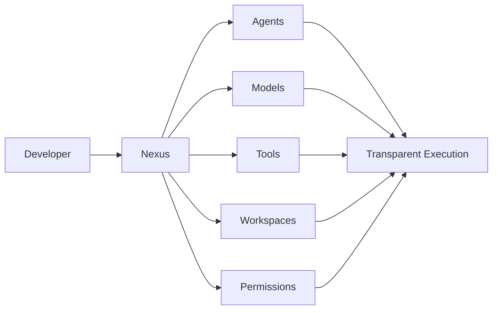
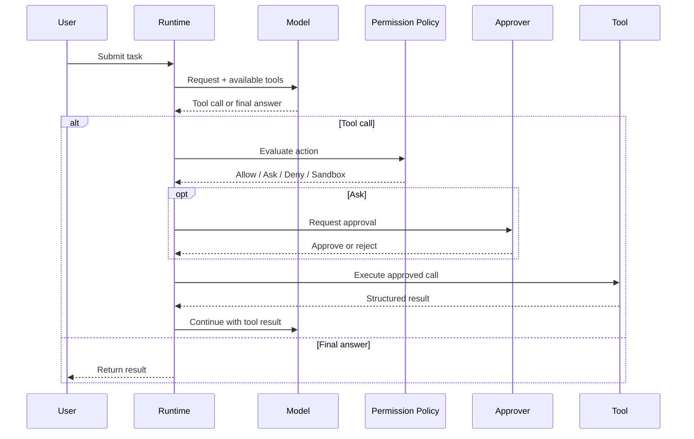
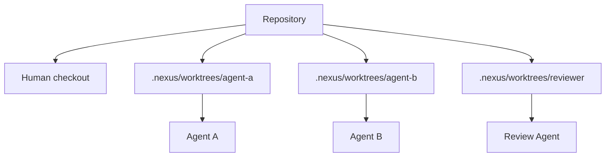
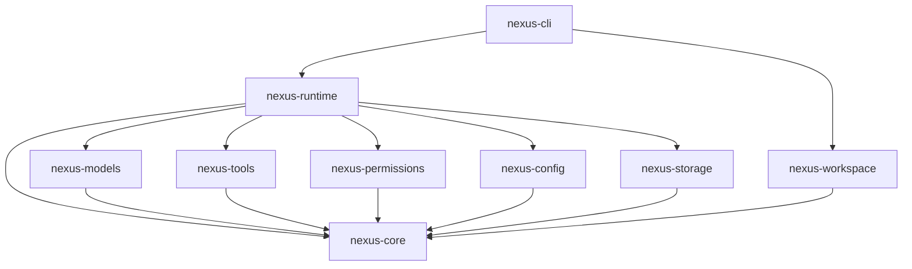

<div align="center">

# ◈ Nexus

### The programmable AI harness for developers, agents, and autonomous workflows.

**Local-first · Model-agnostic · Tool-native · Workspace-isolated · Transparent by design**

[](https://www.rust-lang.org/)
[](https://github.com/timothynn/Nexus/actions/workflows/ci.yml)
[](LICENSE)
[](https://github.com/timothynn/Nexus/issues)
[](https://github.com/timothynn/Nexus/pulls)

[**Get Started**](#-quick-start) · [**What's Working**](#-whats-working-now) · [**Execution Loop**](#-model-driven-tool-loop) · [**Workspaces**](#-isolated-git-workspaces) · [**Architecture**](#-architecture) · [**Roadmap**](#-roadmap) · [**Contributing**](#-contributing)

</div>

---

> **Nexus is not just another AI chat app.**
>
> It is a configurable AI runtime where models, agents, tools, permissions, context, memory, workflows, workspaces, and interfaces are composable primitives.

## ⚡ Why Nexus?



Nexus is being built around one core idea:

> **AI should be powerful without being a black box.**

At runtime, Nexus should make it possible to inspect **what the agent is doing, why it is doing it, which model it selected, what context it received, which tools it can access, what workspace it is operating in, and what permissions apply**.

## ✨ Design Goals

| | Goal | What it means |
|---|---|---|
| 🧩 | **Composable** | Build custom agent pipelines from small, explicit primitives. |
| 🧠 | **Model-agnostic** | Avoid coupling Nexus to a single AI provider. |
| 🔍 | **Transparent** | Inspect context, tool calls, costs, events, workspaces, and execution history. |
| 🛡️ | **Permission-aware** | Keep powerful tools behind explicit, configurable policies. |
| 🌳 | **Workspace-isolated** | Give coding agents isolated Git worktrees instead of sharing one checkout. |
| 🏠 | **Local-first** | Keep local workflows and sensitive operations on the user's machine. |
| ⚙️ | **Highly configurable** | Configure behavior globally, per project, per agent, workspace, or run. |
| 🔌 | **Extensible** | Future support for MCP, plugins, skills, hooks, and custom providers. |

## 🚀 Quick Start

> **Current state:** Nexus now has a bounded model-driven tool loop. The runtime can expose provider-neutral tool schemas, receive structured tool calls, enforce permissions, execute approved tools, feed results back to the model, and stop at an explicit step limit. The next major milestone is a real provider and a usable end-to-end coding-agent CLI.

### Prerequisites

- Rust toolchain with Rust 2024 edition support
- Git

### Clone and build

```bash
git clone https://github.com/timothynn/Nexus.git
cd Nexus
cargo build --workspace
```

### Run the CLI

```bash
cargo run -p nexus-cli -- run "inspect this repository"
```

### Stream a run

```bash
cargo run -p nexus-cli -- run --stream "explain this codebase"
```

### Inspect the environment

```bash
cargo run -p nexus-cli -- doctor
```

## 🟢 What's Working Now

### Model gateway

- Provider-neutral `ModelProvider` contract
- Model identities and capabilities
- Structured chat requests and responses
- Streaming model events
- Provider-neutral tool definitions and JSON schemas
- Provider-neutral structured tool call responses
- Correlated tool result messages
- Provider registry
- Deterministic mock provider for local development and tests
- Runtime execution for normal and streaming responses

### Model-driven tool loop

- Bounded multi-step agent loop
- Tool definitions sent with model requests
- Structured model tool calls
- Tool results fed back into conversation state
- Aggregated token usage across steps
- Explicit maximum-step protection
- Provider capability checks before tool execution

### Tool foundation

- Tool registry with duplicate protection and discovery
- Structured JSON tool requests and responses
- Tool metadata and input schemas
- Tool lifecycle contract
- Workspace-rooted filesystem read tool
- Structured `shell.execute` tool
- Direct program + argument execution with **no command shell interpolation**
- Workspace-bounded working directories
- Configurable execution timeout with an upper policy limit

### Permission foundation

- Explicit `allow`, `ask`, `deny`, and `sandbox` decisions
- Rule-based policies
- Exact and wildcard action rules such as `filesystem.*`
- `ask` is never silently converted into `allow`
- Pluggable approval boundary for CLI, desktop, IDE, or remote approval UX
- Runtime enforcement before every registered tool execution

### Isolated Git workspaces

- Dedicated `nexus-workspace` crate
- Git worktrees created under `.nexus/worktrees/`
- Isolated `nexus/<workspace-name>` branches
- Workspace listing
- Status inspection
- Diff inspection
- Safe removal
- **No automatic merge into the user's main checkout**

## 🔄 Model-Driven Tool Loop

The core agent execution path is now implemented:



The loop is intentionally bounded:

```text
Task → Model → Tool Call? → Permission → Approval? → Tool → Result → Model
                         ↑                                  │
                         └──────── until final answer ────────┘
```

A run that keeps requesting tools past its configured limit fails explicitly instead of looping forever.

## 🌳 Isolated Git Workspaces

Worktree isolation is a core Nexus primitive for future parallel agents.



Create an isolated workspace:

```bash
nexus worktree create auth-refactor
```

List Nexus-managed workspaces:

```bash
nexus worktree list
```

Inspect changes without switching branches:

```bash
nexus worktree status auth-refactor
nexus worktree diff auth-refactor
```

Remove a workspace:

```bash
nexus worktree remove auth-refactor
```

Force removal when Git refuses because of local changes:

```bash
nexus worktree remove auth-refactor --force
```

<details>
<summary><strong>Why worktrees instead of temporary clones?</strong></summary>

Git worktrees are lightweight and share the repository object database while giving each agent an independent working directory and branch. That makes them a strong foundation for parallel coding agents, review agents, experiment branches, and reproducible agent runs.

Nexus intentionally treats the worktree as a first-class **workspace abstraction**. Git worktrees are only the first backend; future implementations can target containers, remote machines, or sandboxed workers without changing the higher-level agent model.

</details>

## 🧬 Architecture

Nexus uses a modular Rust workspace with explicit dependency boundaries.

```text
apps/
└── nexus-cli/                 CLI entrypoint

crates/
├── nexus-core/                Stable domain types and contracts
├── nexus-config/              Configuration loading and resolution
├── nexus-models/              Provider-neutral model contracts
├── nexus-tools/               Tool registry and local tool boundaries
├── nexus-permissions/         Policy evaluation and enforcement
├── nexus-runtime/             Agent execution loop and orchestration
├── nexus-storage/             Session and persistence contracts
└── nexus-workspace/           Isolated workspace implementations
```

### Dependency flow



**Architectural rule:** `nexus-core` stays dependency-light and defines the stable language shared by the rest of the system.

<details>
<summary><strong>🧠 Why this structure?</strong></summary>

Nexus is expected to grow from a coding-agent runtime into a broader AI platform. Keeping models, tools, permissions, storage, workspaces, and interfaces behind explicit contracts prevents provider-specific or UI-specific code from leaking into the core.

That makes future additions—TUI, desktop UI, MCP, plugins, skills, remote workers, additional model providers, and sandbox backends—extensions rather than rewrites.

</details>

## 🧩 Core Primitives

```text
Agent
 ├── Identity
 ├── Model
 ├── Instructions
 ├── Context Rules
 ├── Tools
 ├── Permissions
 ├── Workspace
 ├── Memory
 ├── Skills
 └── Execution Policy

Run
 ├── Input
 ├── Context
 ├── Model Events
 ├── Tool Events
 ├── Permission Decisions
 ├── Workspace Diff
 ├── Costs & Metrics
 └── Final Result
```

## ⚙️ Configuration Philosophy

Nexus should work with sensible defaults while still allowing deep customization.

Planned precedence:

```text
CLI Flags
    ↓
Environment Variables
    ↓
Project Configuration (.nexus/)
    ↓
User Configuration
    ↓
Built-in Defaults
```

Example target configuration:

```yaml
agent:
  name: nexus-engineer
  model: auto

permissions:
  terminal: ask
  filesystem: allow
  network: ask

workspace:
  strategy: worktree

context:
  strategy: hybrid
```

## 🗺️ Roadmap

### Phase 1 — Execution Core

- [x] Rust workspace and crate boundaries
- [x] Initial CLI scaffold
- [x] Core domain contracts
- [x] Configuration boundary
- [x] Model provider contracts
- [x] Streaming model execution
- [x] Mock provider
- [x] Tool registry and JSON schemas
- [x] Filesystem read tool
- [x] Structured shell tool with timeout limits
- [x] Permission evaluation and enforcement
- [x] Pluggable approval boundary
- [x] Bounded model-driven tool loop
- [x] Isolated Git worktree lifecycle
- [ ] CLI approval UX
- [ ] Cancellation and timeout propagation through runs
- [ ] Execution audit events
- [ ] Local session persistence
- [ ] End-to-end CLI agent with a real provider

### Phase 2 — Context + Real Providers

- [ ] OpenAI-compatible provider
- [ ] Provider configuration and model selection
- [ ] Repository discovery
- [ ] Hierarchical instructions
- [ ] Code indexing and search
- [ ] Git-aware context
- [ ] Token budgets
- [ ] Context inspector
- [ ] SQLite sessions and replay
- [ ] TUI

### Phase 3 — Parallel Agents

- [ ] Subagents and task graphs
- [ ] Parallel execution
- [ ] One isolated workspace per coding agent
- [ ] Supervisor and reviewer patterns
- [ ] Workspace metadata and cleanup policies
- [ ] Sandboxed/container workspace backends

### Phase 4 — Extensibility + Desktop

- [ ] MCP client support
- [ ] Skills
- [ ] Hooks
- [ ] Plugin system
- [ ] Public SDKs
- [ ] Tauri desktop application
- [ ] Customizable workspace UI
- [ ] Remote workers
- [ ] Team collaboration

## 📊 Project Status

| Area | Status |
|---|---|
| Workspace architecture | 🟢 Implemented |
| CLI | 🟢 Working foundation |
| Core contracts | 🟢 Implemented |
| Model gateway | 🟢 Contracts + streaming + tool calls |
| Agent runtime | 🟢 Bounded tool loop foundation |
| Tool execution | 🟢 Filesystem + structured shell tools |
| Permissions | 🟢 Policies + approval boundary + enforcement |
| Git workspaces | 🟢 Lifecycle foundation |
| Persistence | 🟡 Contracts only |
| Context engine | ⚪ Planned |
| MCP | ⚪ Planned |
| Plugins | ⚪ Planned |
| TUI | ⚪ Planned |
| Desktop UI | ⚪ Planned |

> 🟢 Implemented &nbsp; 🟡 In progress &nbsp; ⚪ Planned

## 🛠️ Development Workflow

```bash
# Format
cargo fmt --all

# Lint
cargo clippy --workspace --all-targets -- -D warnings

# Test
cargo test --workspace

# Build
cargo build --workspace
```

The repository CI enforces the same quality gates before changes are merged.

## 🤝 Contributing

Nexus is still early, so architecture decisions matter more than raw feature count.

A good contribution should:

1. Keep crate responsibilities clear.
2. Avoid coupling the core to a specific provider or UI.
3. Prefer explicit contracts over hidden assumptions.
4. Include tests where behavior is introduced.
5. Keep execution observable.
6. Treat workspace isolation and permissions as first-class concerns.
7. Never silently merge autonomous agent changes into a user's branch.

Before opening a large feature, check the existing architecture and roadmap documents under `docs/`.

## 💭 The Nexus Principle

> **Don't build an AI assistant that locks developers into one workflow. Build the primitives that let developers create their own.**

Nexus aims to become a programmable layer between humans, AI models, tools, workspaces, and autonomous systems.

---

<div align="center">

**Built for people who want to understand and control their AI.**

⭐ Star the repository if you want to follow the project.

</div>
