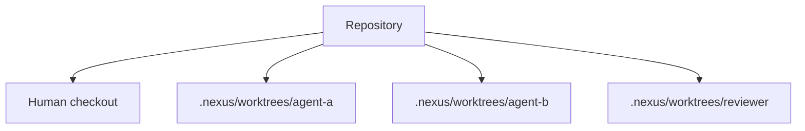
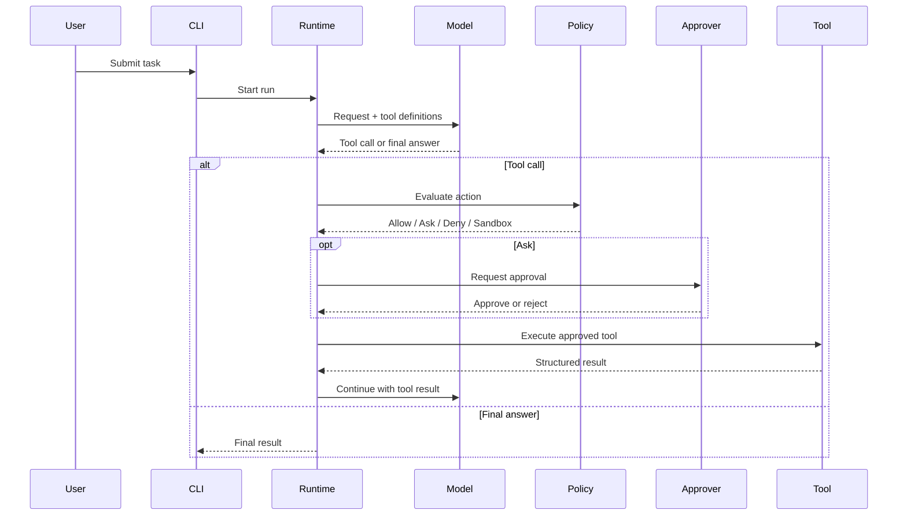
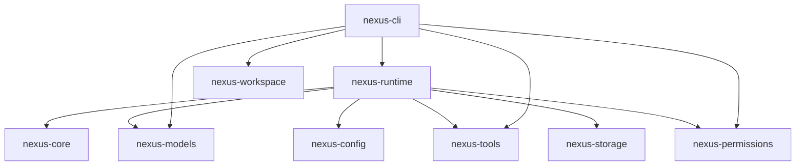

<div align="center">

# ◈ Nexus

### The programmable AI harness for developers, agents, and autonomous workflows.

**Local-first · Model-agnostic · Tool-native · Workspace-isolated · Transparent by design**

[](https://www.rust-lang.org/)
[](https://github.com/timothynn/Nexus/actions/workflows/ci.yml)
[](LICENSE)
[](https://github.com/timothynn/Nexus/issues)
[](https://github.com/timothynn/Nexus/pulls)

[**Get Started**](#-quick-start) · [**What's Working**](#-whats-working-now) · [**Agent Loop**](#-agent-execution-loop) · [**Workspaces**](#-isolated-git-workspaces) · [**Architecture**](#-architecture) · [**Roadmap**](#-roadmap)

</div>

---

> **Nexus is not just another AI chat app.** It is a configurable AI runtime where models, agents, tools, permissions, context, memory, workflows, workspaces, and interfaces are composable primitives.

## ⚡ Why Nexus?


> **AI should be powerful without becoming a black box.**

Nexus is designed so the execution path can expose what happened: selected provider, model request, available tools, permission decisions, approvals, workspace boundaries, tool results, and eventually durable run traces.

## 🚀 Quick Start

### Prerequisites

- Rust toolchain with Rust 2024 edition support
- Git

```bash
git clone https://github.com/timothynn/Nexus.git
cd Nexus
cargo build --workspace
```

### Local deterministic run

```bash
cargo run -p nexus-cli -- run "inspect this repository"
```

### Streaming mock run

```bash
cargo run -p nexus-cli -- run --stream "explain this codebase"
```

### Real OpenAI-compatible provider

Nexus now includes an adapter for OpenAI-compatible Chat Completions endpoints. The CLI reads the API key from an environment variable instead of storing credentials in configuration.

```bash
export OPENAI_API_KEY="..."

cargo run -p nexus-cli -- run \
  --provider openai-compatible \
  --model "your-model-id" \
  "inspect this repository"
```

The adapter uses bearer-token authentication and an OpenAI-compatible Chat Completions request shape; the provider boundary is kept vendor-neutral so additional adapters can be added without changing the runtime contracts.

### Run as an agent with built-in tools

```bash
cargo run -p nexus-cli -- run \
  --provider openai-compatible \
  --model "your-model-id" \
  --tools \
  "inspect this repository and explain the architecture"
```

When the model requests `shell.execute`, Nexus asks for approval:

```text
[nexus] allow `shell.execute`? [y/N]
```

For non-interactive automation, `--yes` approves `ask` actions automatically. Use that only when the execution environment and policy are already trusted.

### Worktrees

```bash
nexus worktree create auth-refactor
nexus worktree list
nexus worktree status auth-refactor
nexus worktree diff auth-refactor
nexus worktree remove auth-refactor
```

## 🟢 What's Working Now

### 🧠 Model gateway

- Provider-neutral `ModelProvider` contract
- Structured chat requests and responses
- Model capabilities
- Streaming events
- Provider-neutral tool definitions and JSON schemas
- Provider-neutral structured tool calls
- Correlated tool result messages
- Deterministic mock provider
- **OpenAI-compatible Chat Completions provider**
- CLI provider selection
- Environment-based API key loading

### 🔄 Agent runtime

- Bounded model-driven tool loop
- Available tools sent to the model with JSON schemas
- Structured tool calls received from the provider
- Permission enforcement before execution
- Tool results added back into conversation state
- Token usage aggregated across agent steps
- Explicit maximum-step protection
- Provider capability checks

### 🛠️ Built-in tools

| Tool | Status | Boundary |
|---|---|---|
| `filesystem.read` | 🟢 | Existing paths must remain inside the workspace root |
| `shell.execute` | 🟢 | Direct program + args, workspace cwd, timeout policy, no command shell |

### 🛡️ Permissions and approvals

```text
Tool request
    ↓
Policy evaluation
    ├── Allow   → execute
    ├── Ask     → approval boundary → execute or reject
    ├── Deny    → block
    └── Sandbox → require sandbox backend
```

Implemented:

- `allow`, `ask`, `deny`, and `sandbox` decisions
- Exact and wildcard rules such as `filesystem.*`
- Pluggable approval boundary
- CLI approval prompts
- Runtime enforcement before every tool execution
- `ask` is never silently treated as `allow`

### 🌳 Isolated Git workspaces



- Dedicated `nexus-workspace` crate
- Isolated `nexus/<workspace-name>` branches
- Worktree listing, status, and diff inspection
- Safe removal
- **No automatic merge into the user's primary checkout**

## 🔄 Agent Execution Loop



The loop is bounded:

```text
Task → Model → Tool Call? → Permission → Approval? → Tool → Result → Model
                         ↑                                  │
                         └──────── until final answer ────────┘
```

A run that exceeds its configured step limit fails explicitly instead of looping forever.

## 🧬 Architecture

```text
apps/
└── nexus-cli/                 CLI entrypoint

crates/
├── nexus-core/                Stable domain types and contracts
├── nexus-config/              Configuration loading and resolution
├── nexus-models/              Provider-neutral contracts + adapters
├── nexus-tools/               Tool registry and local tool boundaries
├── nexus-permissions/         Policy evaluation and approvals
├── nexus-runtime/             Agent loop and orchestration
├── nexus-storage/             Session and persistence contracts
└── nexus-workspace/           Isolated workspace implementations
```



**Architectural rule:** `nexus-core` remains dependency-light and defines the stable language shared by the rest of the system.

## ⚙️ Configuration Philosophy

Nexus should work with sensible defaults while still allowing deep customization.

Target precedence:

```text
CLI Flags
    ↓
Environment Variables
    ↓
Project Configuration (.nexus/)
    ↓
User Configuration
    ↓
Built-in Defaults
```

Example target configuration:

```yaml
agent:
  name: nexus-engineer
  model: auto

permissions:
  terminal: ask
  filesystem: allow
  network: ask

workspace:
  strategy: worktree

context:
  strategy: hybrid
```

## 🗺️ Roadmap

### Phase 1 — Execution Core

- [x] Rust workspace and crate boundaries
- [x] Model contracts and capabilities
- [x] Mock provider and streaming foundation
- [x] OpenAI-compatible provider
- [x] Provider selection in the CLI
- [x] Tool registry and JSON schemas
- [x] Filesystem read tool
- [x] Structured shell tool with timeout policy
- [x] Permission enforcement
- [x] CLI approval prompts
- [x] Bounded model-driven tool loop
- [x] Git worktree lifecycle
- [ ] Cancellation propagation
- [ ] Execution audit events
- [ ] Local session persistence

### Phase 2 — Context + Sessions

- [ ] Project `.nexus/` configuration
- [ ] Global configuration and diagnostics
- [ ] SQLite sessions
- [ ] Run history and replay
- [ ] Repository discovery
- [ ] Hierarchical instructions
- [ ] Code indexing and search
- [ ] Git-aware context
- [ ] Context inspector and token budgets

### Phase 3 — Parallel Agents

- [ ] One isolated workspace per coding agent
- [ ] Parallel subagents
- [ ] Supervisor and reviewer patterns
- [ ] Task graphs and dependencies
- [ ] Automatic workspace cleanup
- [ ] Sandboxed/container workspace backends

### Phase 4 — Extensibility + Desktop

- [ ] MCP client support
- [ ] Skills and hooks
- [ ] Plugin system
- [ ] TUI
- [ ] Tauri desktop application
- [ ] Remote workers
- [ ] Team collaboration

## 📊 Project Status

| Area | Status |
|---|---|
| CLI | 🟢 Usable foundation |
| Core contracts | 🟢 Implemented |
| Model gateway | 🟢 Mock + OpenAI-compatible |
| Agent runtime | 🟢 Bounded tool loop |
| Tool execution | 🟢 Filesystem + structured shell |
| Permissions | 🟢 Policies + CLI approvals |
| Git workspaces | 🟢 Lifecycle foundation |
| Persistence | 🟡 Contracts only |
| Context engine | ⚪ Planned |
| MCP | ⚪ Planned |
| Parallel agents | ⚪ Planned |
| Desktop UI | ⚪ Planned |

> 🟢 Implemented &nbsp; 🟡 In progress &nbsp; ⚪ Planned

## 🛠️ Development Workflow

```bash
cargo fmt --all
cargo build --workspace --all-targets
cargo test --workspace
cargo clippy --workspace --all-targets -- -D warnings
```

CI enforces the same quality gates.

## 🤝 Contributing

1. Keep crate responsibilities clear.
2. Avoid coupling the core to a specific provider or UI.
3. Prefer explicit contracts over hidden assumptions.
4. Add tests at stable public seams.
5. Keep execution observable.
6. Treat workspace isolation and permissions as first-class concerns.
7. Never silently merge autonomous agent changes into a user's branch.

## 💭 The Nexus Principle

> **Don't build an AI assistant that locks developers into one workflow. Build the primitives that let developers create their own.**

---

<div align="center">

**Built for people who want to understand and control their AI.**

⭐ Star the repository if you want to follow the project.

</div>
