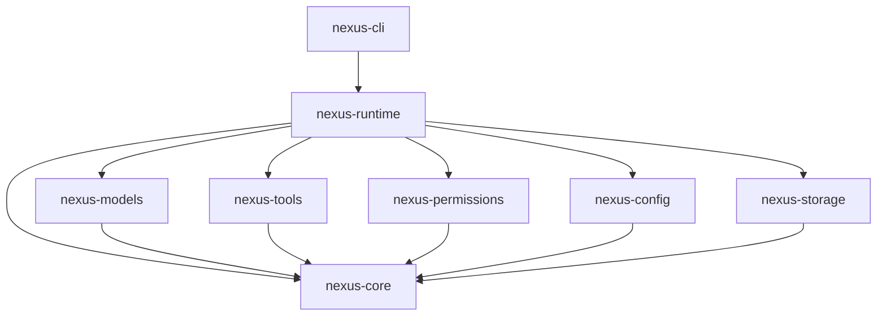
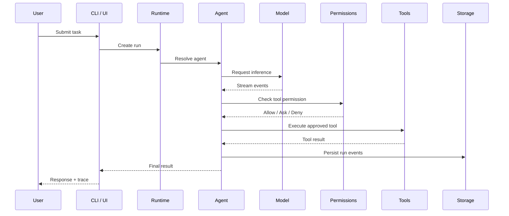

<div align="center">

# ◈ Nexus

### The programmable AI harness for developers, agents, and autonomous workflows.

**Local-first · Model-agnostic · Tool-native · Transparent by design**

[](https://www.rust-lang.org/)
[](https://github.com/timothynn/Nexus/actions/workflows/ci.yml)
[](LICENSE)
[](https://github.com/timothynn/Nexus/issues)
[](https://github.com/timothynn/Nexus/pulls)

[**Get Started**](#-quick-start) · [**Architecture**](#-architecture) · [**Roadmap**](#-roadmap) · [**Contributing**](#-contributing)

</div>

---

> **Nexus is not just another AI chat app.**
>
> It is a configurable AI runtime where models, agents, tools, permissions, context, memory, workflows, and interfaces are composable primitives.

## ⚡ Why Nexus?


Nexus is being built around one core idea:

> **AI should be powerful without being a black box.**

At runtime, Nexus should make it possible to inspect **what the agent is doing, why it is doing it, which model it selected, what context it received, which tools it can access, and what permissions apply**.

## ✨ Design Goals

| | Goal | What it means |
|---|---|---|
| 🧩 | **Composable** | Build custom agent pipelines from small, explicit primitives. |
| 🧠 | **Model-agnostic** | Avoid coupling Nexus to a single AI provider. |
| 🔍 | **Transparent** | Inspect context, tool calls, costs, events, and execution history. |
| 🛡️ | **Permission-aware** | Keep powerful tools behind explicit, configurable policies. |
| 🏠 | **Local-first** | Keep local workflows and sensitive operations on the user's machine. |
| ⚙️ | **Highly configurable** | Configure behavior globally, per project, per agent, or per run. |
| 🔌 | **Extensible** | Future support for MCP, plugins, skills, hooks, and custom providers. |

## 🚀 Quick Start

> **Current state:** Nexus is in its early Phase 1 bootstrap. The workspace and core contracts are actively being implemented.

### Prerequisites

- Rust toolchain with Rust 2024 edition support
- Git

### Clone and build

```bash
git clone https://github.com/timothynn/Nexus.git
cd Nexus
cargo build --workspace
```

### Run the CLI

```bash
cargo run -p nexus-cli -- run "inspect this repository"
```

### Check the development environment

```bash
cargo run -p nexus-cli -- doctor
```

### Useful commands

| Command | Purpose |
|---|---|
| `nexus run "..."` | Run a task through the Nexus runtime |
| `nexus config` | Inspect the configuration boundary |
| `nexus doctor` | Run environment diagnostics |
| `cargo test --workspace` | Run workspace tests |
| `cargo fmt --all -- --check` | Verify formatting |
| `cargo clippy --workspace --all-targets -- -D warnings` | Run strict linting |

<details>
<summary><strong>💡 Prefer running from source?</strong></summary>

During early development, the CLI can be run directly through Cargo:

```bash
cargo run -p nexus-cli -- --help
```

A packaged installation flow will be added later, once the CLI surface stabilizes.

</details>

## 🧬 Architecture

Nexus uses a modular Rust workspace with explicit dependency boundaries.

```text
apps/
└── nexus-cli/                 CLI entrypoint

crates/
├── nexus-core/                Stable domain types and contracts
├── nexus-config/              Configuration loading and resolution
├── nexus-models/              Provider-neutral model contracts
├── nexus-tools/               Tool contracts and execution boundaries
├── nexus-permissions/         Policy evaluation and approval contracts
├── nexus-runtime/             Agent execution loop and orchestration
└── nexus-storage/             Session and persistence contracts
```

### Dependency flow



**Architectural rule:** `nexus-core` stays dependency-light and defines the stable language shared by the rest of the system.

<details>
<summary><strong>🧠 Why this structure?</strong></summary>

Nexus is expected to grow from a coding-agent runtime into a broader AI platform. Keeping models, tools, permissions, storage, and interfaces behind explicit contracts prevents provider-specific or UI-specific code from leaking into the core.

That makes future additions—desktop UI, TUI, MCP, plugins, skills, remote workers, and additional model providers—extensions rather than rewrites.

</details>

## 🔄 The Nexus Execution Model

The initial runtime is designed around a visible execution lifecycle:



The goal is for every stage of this flow to eventually be inspectable and configurable.

## 🧩 Core Primitives

Nexus is evolving around the following primitives:

```text
Agent
 ├── Identity
 ├── Model
 ├── Instructions
 ├── Context Rules
 ├── Tools
 ├── Permissions
 ├── Memory
 ├── Skills
 └── Execution Policy

Run
 ├── Input
 ├── Context
 ├── Model Events
 ├── Tool Events
 ├── Permission Decisions
 ├── Costs & Metrics
 └── Final Result
```

### Planned model capabilities

- Manual model selection
- Provider abstraction
- Streaming responses
- Capability discovery
- Fallback models
- Cost-aware routing
- Latency-aware routing
- Multi-model workflows
- Local and cloud model support

### Planned tool capabilities

- Filesystem access
- Shell execution
- Git integration
- Code search and indexing
- Structured tool schemas
- Streaming tool output
- Cancellation and timeouts
- Sandboxing
- Audit history

### Planned extensibility

- MCP servers
- Plugins
- Skills
- Hooks
- Custom tools
- Custom model providers
- Workflow nodes
- UI extensions

## ⚙️ Configuration Philosophy

Nexus should work with sensible defaults while still allowing deep customization.

Planned precedence:

```text
CLI Flags
    ↓
Environment Variables
    ↓
Project Configuration (.nexus/)
    ↓
User Configuration
    ↓
Built-in Defaults
```

Example future configuration:

```yaml
agent:
  name: nexus-engineer
  model: auto

permissions:
  terminal: ask
  filesystem: allow
  network: ask

context:
  strategy: hybrid
```

<details>
<summary><strong>🔎 The long-term goal: config explainability</strong></summary>

Nexus will eventually provide a command similar to:

```bash
nexus config explain permissions.terminal
```

The output should explain not only the active value, but **where it came from and why it won during configuration resolution**.

</details>

## 🗺️ Roadmap

### Phase 1 — Core MVP

- [x] Rust workspace and crate boundaries
- [x] Initial CLI scaffold
- [x] Core domain contracts
- [x] Configuration boundary
- [x] Model provider contracts
- [x] Tool contracts
- [x] Permission contracts
- [x] Runtime vertical slice
- [x] Session storage boundary
- [x] CI workflow
- [ ] Streaming model execution
- [ ] First concrete model provider
- [ ] Tool registry
- [ ] Filesystem tool
- [ ] Shell tool
- [ ] Permission enforcement
- [ ] Local session persistence
- [ ] End-to-end agent run

### Phase 2 — Developer Harness

- [ ] TUI
- [ ] Repository indexing
- [ ] Context engine
- [ ] Git-aware workflows
- [ ] Diff review
- [ ] Agent templates
- [ ] MCP client support
- [ ] Skills and hooks
- [ ] Model routing

### Phase 3 — Nexus Desktop

- [ ] Tauri desktop application
- [ ] Customizable workspace
- [ ] Visual agent management
- [ ] Context inspector
- [ ] Run replay
- [ ] Plugin manager
- [ ] Workflow editor

### Phase 4 — Agent Platform

- [ ] Multi-agent orchestration
- [ ] Remote workers
- [ ] Automation triggers
- [ ] Public SDKs
- [ ] Plugin ecosystem
- [ ] Skill registry
- [ ] Team collaboration

## 📊 Project Status

| Area | Status |
|---|---|
| Workspace architecture | 🟢 Bootstrapped |
| CLI | 🟢 Initial scaffold |
| Core contracts | 🟢 Initial scaffold |
| Model gateway | 🟡 Contracts defined |
| Agent runtime | 🟡 Vertical slice |
| Tool execution | 🟡 Contracts defined |
| Permissions | 🟡 Contracts defined |
| Persistence | 🟡 Contracts defined |
| MCP | ⚪ Planned |
| Plugins | ⚪ Planned |
| TUI | ⚪ Planned |
| Desktop UI | ⚪ Planned |

> 🟢 Implemented &nbsp; 🟡 In progress &nbsp; ⚪ Planned

## 🛠️ Development Workflow

```bash
# Format
cargo fmt --all

# Lint
cargo clippy --workspace --all-targets -- -D warnings

# Test
cargo test --workspace

# Build
cargo build --workspace
```

The repository CI is intended to enforce the same quality gates before changes are merged.

## 🤝 Contributing

Nexus is still early, so architecture decisions matter more than raw feature count.

A good contribution should:

1. Keep crate responsibilities clear.
2. Avoid coupling the core to a specific provider or UI.
3. Prefer explicit contracts over hidden assumptions.
4. Include tests where behavior is introduced.
5. Keep execution observable.
6. Consider cancellation, errors, and permissions as first-class concerns.

Before opening a large feature, check the existing architecture and roadmap documents under `docs/`.

## 💭 The Nexus Principle

> **Don't build an AI assistant that locks developers into one workflow. Build the primitives that let developers create their own.**

Nexus aims to become a programmable layer between humans, AI models, tools, and autonomous systems.

---

<div align="center">

**Built for people who want to understand and control their AI.**

⭐ Star the repository if you want to follow the project.

</div>
